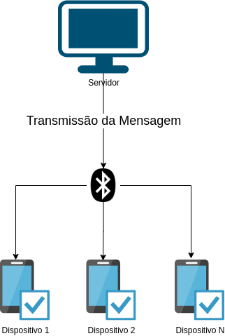
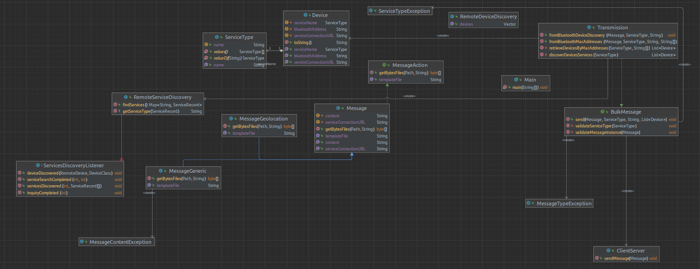
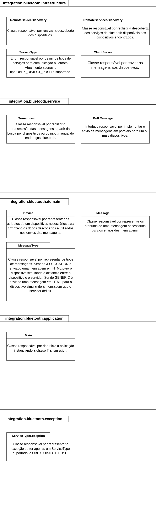

# Bluetooth Integration

## Contexto de negócio

O intuito do projeto é permitir a comunicação entre dispositvos por meio do protocolo de comunicação Bluetooth. É o começo de um estudo que visa integrar aplicações Java com a [Web Bluetooth API](https://developer.mozilla.org/en-US/docs/Web/API/Web_Bluetooth_API), mas a Web Bluetooth API ainda é um recurso experimental, e este projeto também não fez implementações do lado WEB utilizando essa API.

A comunicação atualmente ocorre de forma unidirecional, sendo do servidor (aplicação java) para o(s) dispositivo(s) (smartphone). Há também uma restrição quanto ao tipo de serviço Bluetooth suportado, a aplicação suporta até então apenas o serviço `OBEX Push`, que permite a transmissão de arquivos.



### Tipos de mensagem

É possível transmitir dois tipos de arquivos no formato HTML:

  - GENERIC: a aplicação pode informar uma mensagem qualquer que será incorporada ao conteúdo HTML e entregue ao dispositvo.

    - 

  - GEOLOCATION: a aplicação entrega uma página que calcula a distância entre o servidor e o dispositvo.
    - A localização do servidor é inputada manualmente no arquivo [geolocation-message.html](./src/main/resources/geolocation-message.html), nas variáveis `LAT_SERVER` e `LNG_SERVER`.

    - 

### Diagrama das classes



### Arquitetura

A aplicação teve a sua estrutura baseada em [Layered Architecture](https://www.baeldung.com/cs/layered-architecture), segue abaixo um diagrama de cada camada e suas respectivas classes.



## Contexto técnico

Como referência de estudo para as API's Bluetooth com Java, houve dois artigos principais disponíveis no portal da Oracle:

 - [Using the Java APIs for Bluetooth Wireless Technology, Part 1 - API Overview](https://www.oracle.com/technical-resources/articles/javame/bluetooth-wireless-technology-part1.html)
 - [Using the Java APIs for Bluetooth, Part 2 - Putting the Core APIs to Work](https://www.oracle.com/technical-resources/articles/javame/bluetooth-wireless-technology-part2.html)

Além disso, o estudo sobre uma parte das [especificações bluetooth](https://www.bluetooth.com/specifications/assigned-numbers/).

Para realizar a descoberta de dispositvos através do Bluetooth foi utilizado a biblioteca Java [BlueCove](http://bluecove.org/). A própria BlueCove fornece alguns [exemplos de implementação](http://www.bluecove.org/bluecove-examples/index.html) para que possamos ter um início mais rápido, além disso, há algumas [restrições](https://code.google.com/archive/p/bluecove/wikis/stacks.wiki?authuser=0) a respeito das stacks que o BlueCove suporta. A [biblioteca](https://mvnrepository.com/artifact/io.ultreia/bluecove/2.1.1) está disponível no Maven.

Foi utilizado para desenvolvimento o SO Linux Ubuntu 20.04.4 LTS e o ambiente IntelliJ IDEA.

*P.S.: Para utlizar o BlueCove enfrentei problemas ao executar o projeto, similar a [esse problema reportado no stack overflow](https://stackoverflow.com/questions/30946821/bluecove-with-bluez-chucks-can-not-open-sdp-session-2-no-such-file-or-direct), para o meu ambiente bastou iniciar o IntelliJ com sudo.*

## Como executar

Recomendo buscar utilizar o mesmo ambiente, não foi testado em um ambiente Windows ou Mac.

  * Clone este repositório.
  * Possua o IntelliJ instalado.
  * Inicie o IntelliJ com permissões de administrador (sudo).
  * Busque o projeto clonado e abra-o no IntelliJ.
    * Instale as dependências Maven caso o IntelliJ não faça isso automaticamente ao abrir o projeto.
  * Caminhe pela estrutura de pacotes até o arquivo principal [**Main**](./src/main/java/integration/bluetooth/application/Main.java), localizado na camada de aplicação.
  * Ative o Bluetooth no servidor (aplicação Java) e o Bluetooth do(s) dispositvo(s).

Há dois métodos principais de transmissão de mensagem:

  * `fromBluetoothMacAddresses`: permite transmitir mensagem diretamente para os dispositivos desejados.
    * Parâmetros:
      * [Message](./src/main/java/integration/bluetooth/domain/message/Message.java): permite definir a instância do tipo da mensagem, existem dois tipos que estendem da classe [Message](./src/main/java/integration/bluetooth/domain/message/Message.java):
        * [MessageGeneric](./src/main/java/integration/bluetooth/domain/message/MessageGeneric.java)
        * [MessageGeolocation](./src/main/java/integration/bluetooth/domain/message/MessageGeolocation.java)
      * [ServiceType](./src/main/java/integration/bluetooth/infrastructure/ServiceType.java): permite definir o tipo de serviço Bluetooth utilizado, atualmente suporta apenas o tipo `OBEX_OBJECT_PUSH`. 
      * content: permite definir o conteúdo da mensagem, apenas o tipo de mensagem `GENERIC` faz uso desse atributo em seu template.
      * bluetoothMacAddresses: permite definir os endereços bluetooth dos dispositivos, podendo ser um ou mais (varargs).
  * `fromBluetoothDeviceDiscovery`: permite transmitir mensagem diretamente para os dispositivos descobertos na varredura do Bluetooth.
    * Parâmetros:
      * [Message](./src/main/java/integration/bluetooth/domain/message/Message.java): permite definir a instância do tipo da mensagem, existem dois tipos que estendem da classe [Message](./src/main/java/integration/bluetooth/domain/message/Message.java):
        * [MessageGeneric](./src/main/java/integration/bluetooth/domain/message/MessageGeneric.java)
        * [MessageGeolocation](./src/main/java/integration/bluetooth/domain/message/MessageGeolocation.java)
      * [MessageType](./src/main/java/integration/bluetooth/domain/message/MessageType.java): permite definir o tipo do template da mensagem.
      * [ServiceType](./src/main/java/integration/bluetooth/infrastructure/ServiceType.java): permite definir o tipo de serviço Bluetooth utilizado, atualmente suporta apenas o tipo `OBEX_OBJECT_PUSH`. 

Exemplos de execução:

```java
package integration.bluetooth.application;

import integration.bluetooth.domain.message.MessageGeneric;
import integration.bluetooth.domain.message.MessageGeolocation;
import integration.bluetooth.domain.service.ServiceType;
import integration.bluetooth.service.Transmission;

/**
 * Classe responsável por dar inicio a aplicação instanciando a classe Transmission.
 * @author Paulo Lima (durvaal - GitHub user)
 */
public class Main {

  public static void main(String[] args) {
    // Instancie a classe Transmission
    Transmission transmission = new Transmission();
    // Envie uma mensagem genérica informando o endereço bluetooth do dispositivo
    transmission.fromBluetoothMacAddresses(new MessageGeneric(), ServiceType.OBEX_OBJECT_PUSH, "Atenção", "38E39F6E4F37");
    // Envie uma mensagem de gelocalização informando o endereço bluetooth do dispositivo
    transmission.fromBluetoothMacAddresses(new MessageGeolocation(), ServiceType.OBEX_OBJECT_PUSH, "Atenção", "38E39F6E4F37");
    // Envie uma mensagem genérica descobrindo o dispositivo através da rede bluetooth
    transmission.fromBluetoothDeviceDiscovery(new MessageGeneric(), ServiceType.OBEX_OBJECT_PUSH, "Atenção");
    // Envie uma mensagem de gelocalização descobrindo o dispositivo através da rede bluetooth
    transmission.fromBluetoothDeviceDiscovery(new MessageGeolocation(), ServiceType.OBEX_OBJECT_PUSH, "Atenção");
  }

}
```

No caso do método de transmissão `fromBluetoothDeviceDiscovery` pode ser que o dispositivo demore a ser encontrado, mesmo que o bluetooth de ambos estejam ativos, obtive mais sucesso ao parear antes da execução os dispositivos, mas sim, é possível fazer isso sem o prévio pareamento. Ainda é incerto a causa exata de em determinadas execuções o dispositivo ser descoberto ou não.

Após a execução serão logada algumas informações no console do IntelliJ, o dispositivo descoberto receberá uma notificação solicitando a permissão para receber o arquivo, após isso, o arquivo pode ser aberto e o conteúdo HTML será renderizado no dispositivo de destino.

Com isso, é possível receber mensagem para um ou mais dispositivos, enviando para mais de um dispositivo é interessante perceber a chegada da mensage é de forma serial, e não de forma paralela.

## Vídeo de apresentação

Acesse [esse link](https://drive.google.com/file/d/1oC7hZMD6kpBnneyIYOHM6gGcsM0Aekyz/view?usp=sharing).

## 🤝 Colaboradores

<table>
  <tr>
    <td align="center">
      <a href="#">
        <br>
        <sub>
          <b>Paulo de Lima Xavier </b>
        </sub>
        <br>
        <sub>
          <b>20190104147</b>
        </sub>
      </a>
    </td>
  </tr>
</table>

#### Obrigado por chegar até aqui! ❤️ <br>
